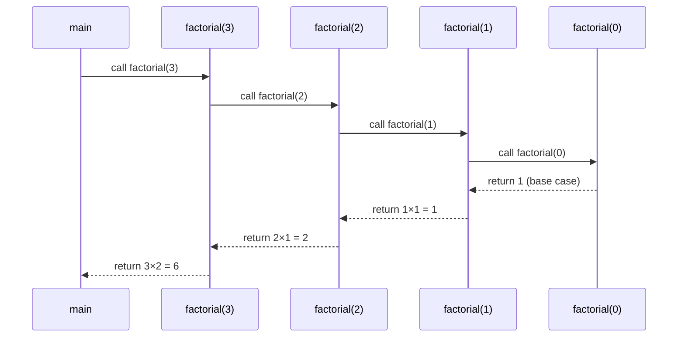
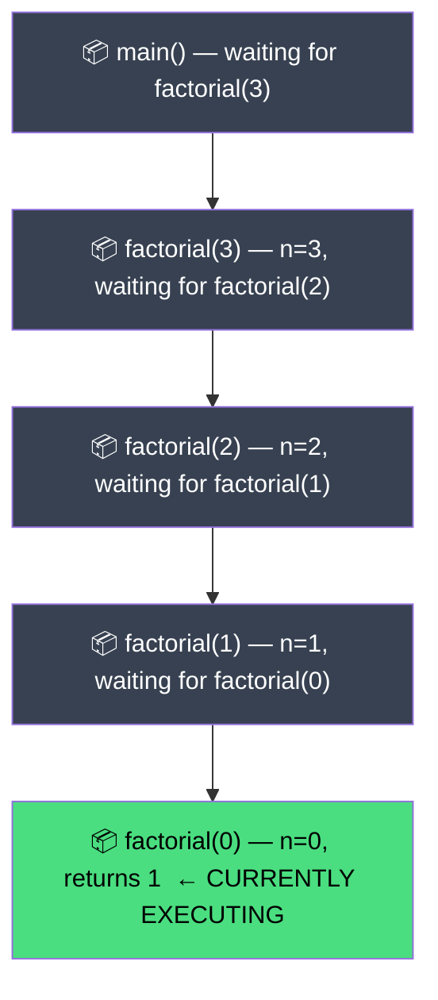
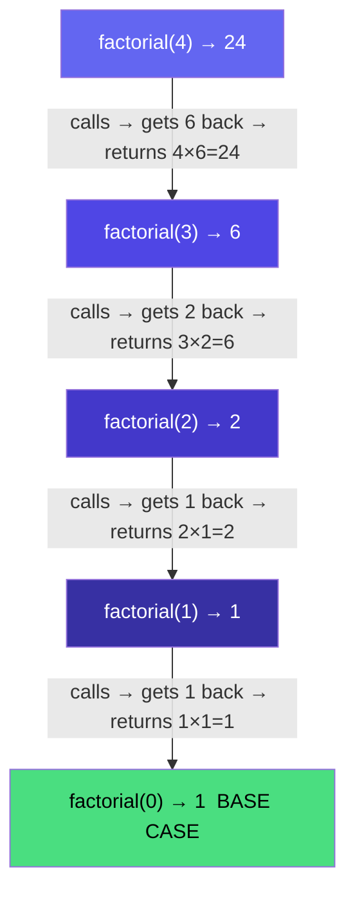

# 🔁 Recursion — Placement Edition
### Notes from a "been-there, interviewed-that" professor's lens

> 🎯 Goal: Build recursion from the ground up — understand it well enough that no interview twist catches you off guard.
> Source: [Striver's A2Z DSA Sheet — Learn Basic Recursion](https://takeuforward.org/strivers-a2z-dsa-course/strivers-a2z-dsa-course-sheet-2/)

---

## 📚 Table of Contents

**Part 1 — Theory & Fundamentals** *(you are here)*
1. [A Word Before We Start](#a-word-before-we-start)
2. [What is Recursion?](#1-what-is-recursion)
3. [Why Recursion Matters](#2-why-recursion-matters)
4. [When to Use Recursion](#3-when-to-use-recursion)
5. [Recursion vs Iteration](#4-recursion-vs-iteration)
6. [Real-World Analogies](#5-real-world-analogies)
7. [Core Terminology](#6-core-terminology)
8. [Internal Working & The Call Stack](#7-internal-working--the-call-stack)
9. [Dry Run Example — Step by Step](#8-dry-run-example--step-by-step)
10. [Generic Recursion Template](#9-generic-recursion-template)
11. [Golden Rules for Recursion Problems](#10-golden-rules-for-recursion-problems)
12. [Time & Space Complexity of Recursion](#11-time--space-complexity-of-recursion)
13. [Common Beginner Mistakes](#12-common-beginner-mistakes)
14. [Key Takeaways](#key-takeaways)
15. [What's Next?](#whats-next)

**Part 2 — Problems 1–3** *(coming next)*
**Part 3 — Problems 4–6** | **Part 4 — Problems 7–9** | **Part 5 — Cheat Sheet & FAQs**

---

## A Word Before We Start

Recursion is the topic where students either have a "lightbulb moment" or get permanently stuck in confusion — there is rarely a middle ground.

The reason people struggle isn't that recursion is complex. It's that they try to **trace every call in their head** before they've built the right mental model. Once you understand *what the call stack actually does*, recursion stops feeling like magic and starts feeling mechanical.

This section builds that model from the ground up. Same format as the rest of this repository:
1. **What it is** (with real intuition, not textbook language)
2. **Why it bites you** (the traps interviewers exploit)
3. **How to not embarrass yourself** (the instincts you need cold)

Don't try to memorize. Try to *see* it.

---

## 1. What is Recursion?

### Concept
Recursion is when a **function calls itself** to solve a smaller version of the same problem, until it reaches a case simple enough to solve directly.

Every recursive solution has exactly two parts:
- **Base Case** → the stopping condition. Without it, you get infinite calls and a crash.
- **Recursive Case** → break the problem into a smaller subproblem and call yourself.

```java
public static void countDown(int n) {
    if (n == 0) return;          // base case — stop here
    System.out.println(n);
    countDown(n - 1);            // recursive case — smaller problem
}
```

Call `countDown(3)` and it prints: `3`, `2`, `1`. Then stops.

### Professor's Note — The Function Trusts Itself
The single biggest mindset shift for beginners: **assume your function already works correctly for a smaller input, and use that to build the answer for the current input.**

You don't need to trace the entire call chain in your head. You only need to answer:
1. What is the base case? (When do I stop?)
2. What smaller version of this problem can I call myself with?
3. How do I use that answer to solve the current problem?

**Interview trap:** An interviewer will ask you to write a recursive function and then ask "walk me through it." They are *not* asking you to trace every single call manually. They want to hear you describe the base case, the recursive step, and how the return value propagates back up. That's the answer they're looking for.

### Memory Tip
Recursion = self-reference with a shrinking problem. Base case = stop. Recursive case = delegate to yourself with less work.

---

## 2. Why Recursion Matters

### Concept
Recursion isn't just a technique — it's the **natural language of problems that have self-similar structure**. A tree is a node plus two smaller trees. A sorted array is an element plus a smaller sorted array. A factorial is `n` times the factorial of `n-1`.

When a problem is defined in terms of itself, recursion often gives you the cleanest, most readable solution — sometimes in 3 lines instead of 30.

### Where You'll See It Later in DSA

| Topic | How Recursion Appears |
|---|---|
| Trees | Almost every tree problem — DFS, height, diameter, LCA |
| Graphs | DFS traversal, connected components |
| Backtracking | Generate all combinations, permutations, subsets |
| Divide & Conquer | Merge Sort, Quick Sort, Binary Search (recursive form) |
| Dynamic Programming | Memoized recursion is the starting point for every DP problem |
| Linked Lists | Reverse, palindrome check, recursive traversal |
| String Problems | Palindrome check, subsequences, parsing |

> 💡 **Placement Insight:** Recursion is not a standalone topic. It is the *foundation* for Trees, Graphs, Backtracking, and Dynamic Programming — which together make up roughly **60–70% of all SDE interview questions**. Getting recursion right now is not optional.

### Memory Tip
Recursion first → then DP, Backtracking, Trees. Skip it → you're building on sand.

---

## 3. When to Use Recursion

### Concept
Not every loop should be a recursive function. Use recursion when the problem has one or more of these properties:

| Signal | Example |
|---|---|
| Problem is defined in terms of itself | Factorial, Fibonacci |
| Tree or graph traversal | In-order, DFS |
| Divide-and-conquer structure | Merge Sort, Binary Search |
| Need to explore all possibilities | Subsets, Permutations, Backtracking |
| Problem shrinks by a constant factor each call | Binary search, power function |
| You need to "undo" a choice | Backtracking — N-Queens, Sudoku |

### When *Not* to Use Recursion
- When `n` is very large and stack depth would hit tens of thousands of levels (stack overflow risk).
- When an iterative solution is equally readable and avoids the function-call overhead.
- When you have no clear base case — every recursive call must get closer to termination.

### Professor's Note
**Interview trap:** "Can you solve this iteratively instead?" — always have an answer. For most recursion problems, the iterative equivalent uses an explicit stack. Knowing this trade-off separates a solid candidate from a great one.

---

## 4. Recursion vs Iteration

### Concept

| Feature | Recursion | Iteration |
|---|---|---|
| Code style | Elegant, mirrors the problem definition | More explicit, uses loops |
| Space usage | O(depth) stack frames on the call stack | O(1) if no auxiliary structure |
| Risk | Stack overflow if base case is wrong or n is huge | Infinite loop if condition is wrong |
| Readability | High for tree/graph/divide-and-conquer | High for simple counting/traversal |
| Debugging | Harder to trace manually | Easier to print/debug step-by-step |
| Performance | Slightly slower (function-call overhead) | Slightly faster (no overhead) |
| Use in interviews | Expected for Trees, Graphs, DP, Backtracking | Expected for Arrays, Strings |

### Professor's Note — Recursion Has a Hidden Space Cost
This is the single most under-asked follow-up question in placements, and the single most revealing:

```java
// This looks like it uses O(1) space...
public static int sum(int n) {
    if (n == 0) return 0;
    return n + sum(n - 1);
}
```

...but it doesn't. Every call to `sum` creates a **stack frame**. Calling `sum(1000)` creates 1001 stack frames in memory simultaneously. The space complexity is **O(n)**, not O(1).

**Interview trap:** "What's the space complexity of your recursive solution?" — always account for the call stack. If you only answer with time complexity, you lose points. This question is asked constantly for Tree and Graph recursion.

### Memory Tip
Recursion space = depth of call stack × memory per frame. Never say "O(1) space" for a recursive solution unless it's tail-recursive and the compiler optimizes it (Java does NOT optimize tail calls).

---

## 5. Real-World Analogies

### Concept
Recursion is everywhere outside of code. Recognizing the pattern in the real world trains your brain to spot it in problems.

**The Matryoshka Doll (Russian Nesting Doll)**
Open a doll → find another doll inside → open that one → find another → until you reach the smallest doll (base case). Each opening is a recursive call. The smallest doll is your base case. Coming back out and closing them again is the return phase.

**The Dictionary Problem**
You look up "recursion" in a dictionary. The definition uses the word "recursive." You look up "recursive" — it says "see recursion." That's an infinite recursion (no base case). A good dictionary eventually reaches words you already know — that's the base case.

**Staircase Problem**
You're climbing stairs. You can ask: "How many ways can I climb `n` stairs if I take 1 or 2 steps at a time?" Answer: `ways(n) = ways(n-1) + ways(n-2)`. The problem defines itself in terms of smaller versions of itself — a recursion tree naturally emerges.

> 💡 **Placement Insight:** Being able to narrate a real-world analogy for recursion during an interview signals that you understand the concept deeply, not just syntactically. Interviewers at top companies deliberately ask "explain recursion to a 10-year-old" — have an analogy ready.

---

## 6. Core Terminology

### 6.1 Recursive Function

**Definition:** A function that contains at least one call to itself.

**Intuition:** It's a function that solves a problem by delegating a smaller version of the same problem to itself.

```java
public static int factorial(int n) {   // this is a recursive function
    if (n == 0) return 1;
    return n * factorial(n - 1);       // calls itself
}
```

**Common interview question:** *"What makes a function recursive vs iterative?"* → A recursive function calls itself. An iterative function uses explicit loops.

---

### 6.2 Recursive Call

**Definition:** The specific line inside a recursive function where the function calls itself with a smaller or simpler input.

**Intuition:** This is the "delegation" step — passing the hard work to a slightly smaller version of yourself.

```java
return n * factorial(n - 1);   // this line is the recursive call
//                  ↑
//          smaller input — n decreases by 1 every call
```

**Key rule:** The argument in the recursive call must move toward the base case. If it doesn't, you have infinite recursion.

---

### 6.3 Base Case

**Definition:** The condition under which the recursive function stops calling itself and returns a direct answer.

**Intuition:** The smallest problem you can solve without recursion. Everything else builds on top of it.

```java
if (n == 0) return 1;   // base case — no more calls, return immediately
```

**Common interview question:** *"What happens if there's no base case?"* → Infinite recursion → the call stack fills up → `StackOverflowError` at runtime.

> ⚠️ **Common Mistake:** Having a base case that is never reached because the recursive call doesn't shrink the input correctly. For example, `factorial(-1)` with the base case `n == 0` will recurse forever into negative numbers.

---

### 6.4 Recursive Case

**Definition:** The part of the function that handles the general (non-base) scenario by reducing the problem and making a recursive call.

**Intuition:** "I don't know the final answer yet, but if someone gives me `factorial(n-1)`, I can compute `factorial(n)` in one step."

```java
return n * factorial(n - 1);   // recursive case
```

The recursive case always has two components:
1. **Decompose:** break the problem into a smaller subproblem.
2. **Combine:** use the result of the subproblem to build the current answer.

---

### 6.5 Call Stack

**Definition:** A region of memory that tracks all active function calls. Each time a function is called, a new entry (stack frame) is pushed. When a function returns, its frame is popped.

**Intuition:** Think of it as a stack of plates. Every function call adds a plate on top. When a function finishes and returns, that plate is removed. The program can only "work on" the topmost plate at any time.

```java
// Calling factorial(3) builds this call stack from top to bottom:
// [ factorial(0) ]   ← currently running (base case)
// [ factorial(1) ]   ← waiting for factorial(0) to return
// [ factorial(2) ]   ← waiting for factorial(1) to return
// [ factorial(3) ]   ← waiting for factorial(2) to return
// [ main()       ]   ← bottom of the stack
```

**Common interview question:** *"What is a call stack and how does recursion use it?"* → Every recursive call adds a frame. The stack unwinds when base cases return.

---

### 6.6 Stack Frame

**Definition:** A block of memory created for each active function call. It stores the function's local variables, parameters, and the return address (where to continue after the call returns).

**Intuition:** Each call to `factorial(n)` has its own private copy of `n`. When `factorial(3)` calls `factorial(2)`, both copies of `n` exist simultaneously in separate frames — `3` in one, `2` in another.

```java
// Each frame for factorial(n) stores:
// - the value of n (parameter)
// - the return address (which line in the caller to go back to)
// - the return value (computed and sent back when the frame pops)
```

> 💡 **Placement Insight:** "How much memory does a recursive function use?" — each stack frame uses O(1) space for its local variables, so `n` recursive calls = O(n) space total. For `factorial(100000)`, that's 100,000 frames simultaneously on the stack — a real concern in production code.

---

### 6.7 Stack Overflow

**Definition:** A runtime error (`StackOverflowError` in Java) that occurs when the call stack runs out of memory — typically because recursion goes too deep without hitting a base case.

**Intuition:** You kept stacking plates until the pile hit the ceiling and everything crashed.

```java
// This will crash with StackOverflowError:
public static int brokenFactorial(int n) {
    return n * brokenFactorial(n - 1);   // no base case — infinite calls
}
```

**Common interview question:** *"How would you handle very deep recursion in Java?"* → Convert to iterative with an explicit stack, or increase the JVM stack size with `-Xss` (but that's a workaround, not a fix).

---

### 6.8 Tail Recursion

**Definition:** A specific form of recursion where the recursive call is the **very last operation** in the function — nothing happens after it returns.

**Intuition:** After the recursive call, there's no pending computation left, so in theory the current stack frame is no longer needed and could be reused.

```java
// NOT tail recursive — must multiply after the call returns:
return n * factorial(n - 1);

// Tail recursive version (using accumulator):
public static int factTail(int n, int acc) {
    if (n == 0) return acc;
    return factTail(n - 1, n * acc);   // last operation is the call itself
}
```

**Important Java note:** Java does **not** optimize tail recursion (no Tail Call Optimization). This is a language design choice. In languages like Scala or Haskell, tail recursion is optimized to use O(1) stack space. In Java, even a tail-recursive function uses O(n) stack space.

**Common interview question:** *"What is tail recursion and does Java optimize it?"* → Tail recursion = last operation is the recursive call. Java does NOT optimize it — important distinction from functional languages.

---

### 6.9 Head Recursion

**Definition:** A form of recursion where the recursive call happens **before** any processing in the function body.

**Intuition:** The function dives all the way to the base case first, then processes data on the way back up.

```java
// Head recursion — call happens first, print happens after:
public static void printAscending(int n) {
    if (n == 0) return;
    printAscending(n - 1);    // recursive call FIRST
    System.out.println(n);    // processing happens on the way BACK UP
}
// Output for n=3: 1, 2, 3  (ascending — processes during unwinding)
```

Contrast with **tail recursion** where processing happens before the call:
```java
public static void printDescending(int n) {
    if (n == 0) return;
    System.out.println(n);    // processing happens BEFORE the call
    printDescending(n - 1);   // recursive call LAST
}
// Output for n=3: 3, 2, 1  (descending — processes during winding)
```

> 💡 **Placement Insight:** Head vs tail recursion is a subtle but frequently asked concept. The key insight — **the order of processing relative to the recursive call determines whether you process on the way down or on the way up.** This matters enormously in problems like printing arrays in reverse or traversing a linked list backwards without extra space.

---

### 6.10 Recursion Tree

**Definition:** A visual tree diagram that shows every function call made during a recursive execution, with each node representing one function call and each branch representing a recursive call made from that function.

**Intuition:** Unroll every call onto paper as a tree. The root is your initial call. Each child is a recursive call. Leaves are base cases. Counting the total nodes gives you time complexity. The maximum depth gives you space complexity.

For linear recursion (factorial):
```
factorial(4)
    └── factorial(3)
            └── factorial(2)
                    └── factorial(1)
                            └── factorial(0) ← base case
```

For branching recursion (Fibonacci):
```
fib(4)
├── fib(3)
│   ├── fib(2)
│   │   ├── fib(1) → 1
│   │   └── fib(0) → 0
│   └── fib(1) → 1
└── fib(2)
    ├── fib(1) → 1
    └── fib(0) → 0
```

**Common interview question:** *"What is the time complexity of Fibonacci recursion?"* → Draw the tree — it has approximately 2ⁿ nodes → O(2ⁿ). Knowing to draw the recursion tree before answering complexity is the mark of someone who actually understands recursion.

---

### 6.11 Backtracking (Brief Introduction)

**Definition:** An extension of recursion where you explore all possible choices, and if a choice leads to a dead end, you **undo** it (backtrack) and try the next option.

**Intuition:** Recursion explores one path. Backtracking explores all paths by undoing wrong choices. It's recursion with an "erase your footsteps" step added.

```java
// Template (fully covered in the advanced section):
void explore(choices, currentState) {
    if (goalReached) { recordAnswer(); return; }
    for (each available choice) {
        makeChoice();
        explore(remainingChoices, updatedState);
        undoChoice();   // ← the "undo" step is what makes it backtracking
    }
}
```

**Common interview question:** *"What is the difference between recursion and backtracking?"* → All backtracking uses recursion. Not all recursion is backtracking. Backtracking adds the constraint that you undo choices which lead to invalid states.

> 💡 **Placement Insight:** Backtracking is how top companies ask recursion questions at SDE-1 level. Problems like generating all permutations, N-Queens, Sudoku Solver, and Word Search are all backtracking. Build your recursion base now — backtracking is the direct next step.

---

## 7. Internal Working & The Call Stack

### Concept
When your Java program runs a function, the JVM (Java Virtual Machine) uses the **call stack** to manage execution. Understanding this mechanism precisely is what separates someone who "knows" recursion from someone who can *debug* it under interview pressure.

### How the Call Stack Works — Step by Step

Every time a function is called:
1. A new **stack frame** is created and pushed onto the call stack.
2. The frame contains: the function's parameters, local variables, and a return address.
3. The CPU pauses the calling function and starts executing the new one.
4. When the new function hits `return`, its frame is **popped** off the stack.
5. Execution resumes in the calling function from where it left off.

For recursion, this happens for every single recursive call — `factorial(1000)` creates 1001 frames, all alive simultaneously in memory.

### Call Stack Visualization for `factorial(3)`



### Memory Snapshot at Peak Stack Depth



> **Read top → bottom = bottom of stack → top of stack.**
> At peak depth, all 5 frames exist simultaneously. As each returns, its frame is destroyed and memory is freed.

### Two Phases of Every Recursive Execution

| Phase | Direction | What Happens |
|---|---|---|
| **Winding phase** | Down toward the base case | Frames are pushed. Functions are called. Work is deferred. |
| **Unwinding phase** | Up back to the original caller | Frames are popped. Return values propagate upward. Work is completed. |

This two-phase structure is why **head recursion processes on the way up** — the actual work happens only after all recursive calls have already been made.

### Professor's Note — The Stack is Physical Memory
The JVM allocates a fixed stack size per thread (default: 512KB–1MB depending on platform). Each stack frame uses real memory. This is why:
- `factorial(100)` is fine — tiny frames, shallow depth.
- `factorial(100000)` throws `StackOverflowError` — 100,000 frames exhaust the stack.

**Interview trap:** "Your recursive solution works for small inputs but crashes on large ones — why?" → Stack overflow. The fix is converting to iterative or using memoized DP, not just "adding more stack." This question is asked deliberately on performance-sensitive problems like DFS on large graphs.

### Memory Tip
Call stack = LIFO structure managed by the JVM. Push on call, pop on return. Each frame = one active function call. Stack overflow = too many frames, too little stack memory.

---

## 8. Dry Run Example — Step by Step

### Picking the Right Example
Dry running `factorial(4)` step by step is the single most important exercise for building recursion intuition. Do this once properly — you'll be able to dry-run any recursive function.

### The Code

```java
public static int factorial(int n) {
    if (n == 0) return 1;          // base case
    return n * factorial(n - 1);   // recursive case
}
```

### Complete Dry Run — `factorial(4)`

**Phase 1 — Winding (calls going down toward base case):**

| Step | Call | n | `n == 0`? | Action |
|---|---|---|---|---|
| 1 | `factorial(4)` | 4 | No | Calls `factorial(3)`, waits |
| 2 | `factorial(3)` | 3 | No | Calls `factorial(2)`, waits |
| 3 | `factorial(2)` | 2 | No | Calls `factorial(1)`, waits |
| 4 | `factorial(1)` | 1 | No | Calls `factorial(0)`, waits |
| 5 | `factorial(0)` | 0 | **Yes** | Returns **1** immediately ✅ |

**Phase 2 — Unwinding (return values coming back up):**

| Step | Returning To | Value Received | Computes | Returns |
|---|---|---|---|---|
| 6 | `factorial(1)` | 1 (from `factorial(0)`) | `1 × 1` | **1** |
| 7 | `factorial(2)` | 1 (from `factorial(1)`) | `2 × 1` | **2** |
| 8 | `factorial(3)` | 2 (from `factorial(2)`) | `3 × 2` | **6** |
| 9 | `factorial(4)` | 6 (from `factorial(3)`) | `4 × 6` | **24** ✅ |

### Recursion Tree with Return Values



### How to Narrate This in an Interview

When asked to "walk through" a recursive function, use this exact structure — it's concise and covers everything an interviewer wants to hear:

1. *"The base case is `n == 0`, which returns 1 directly."*
2. *"For `factorial(4)`, we keep calling with `n-1` until we reach the base case at `factorial(0)`."*
3. *"At peak depth, the call stack has 5 simultaneous frames — `factorial(4)` through `factorial(0)`."*
4. *"On the way back up (unwinding), each frame multiplies its own `n` with the returned value and sends the result up to its caller."*
5. *"Final answer: `4 × 3 × 2 × 1 × 1 = 24`."*

> 💡 **Placement Insight:** Interviewers who ask "trace through this" are testing whether you understand the two phases — winding and unwinding. Candidates who clearly narrate both phases without manually tracing every single number are the ones who pass. The dry run tables above are exactly the format to use on a whiteboard.

---

## 9. Generic Recursion Template

### Concept
Every recursive problem in placements can be mapped onto this three-step template. Learn it once, apply it everywhere.

```java
public static ReturnType solve(parameters) {

    // ─── STEP 1: Base Case ────────────────────────────────────
    // The simplest input where you know the answer directly.
    // This MUST be reachable — or you get infinite recursion.
    if (baseCondition) {
        return directAnswer;
    }

    // ─── STEP 2: Recursive Call ───────────────────────────────
    // Reduce the problem to a smaller version.
    // Trust that solve() works correctly for smaller inputs.
    ReturnType smallerAnswer = solve(smallerParameters);

    // ─── STEP 3: Build & Return ───────────────────────────────
    // Use the smaller answer to compute the current answer.
    return buildCurrentAnswer(smallerAnswer);
}
```

### Template Applied — Factorial

```java
// Base case:       factorial(0) = 1
// Smaller problem: factorial(n-1)
// Combine:         n × factorial(n-1)

public static int factorial(int n) {
    if (n == 0) return 1;                    // Step 1: base case
    int smallerAnswer = factorial(n - 1);    // Step 2: recursive call
    return n * smallerAnswer;                // Step 3: combine
}
```

### Template Applied — Sum of 1 to N

```java
// Base case:       sum(0) = 0
// Smaller problem: sum(n-1)
// Combine:         n + sum(n-1)

public static int sum(int n) {
    if (n == 0) return 0;                    // Step 1: base case
    int smallerAnswer = sum(n - 1);          // Step 2: recursive call
    return n + smallerAnswer;                // Step 3: combine
}
```

> 💡 **Placement Insight:** Structuring your solution in three explicit steps — base case, recursive call, combine — is the style top interviewers expect. It signals a methodology, not luck. Even when you're unsure of the full solution, starting with "let me identify the base case first" immediately builds credibility and gives you a systematic path forward.

---

## 10. Golden Rules for Recursion Problems

| # | Rule | Why It Matters |
|---|---|---|
| 1 | **Always define the base case first.** | Without it, you write a function with no exit — guaranteed crash. |
| 2 | **Ensure every recursive call moves toward the base case.** | If `n` doesn't shrink, you loop forever. |
| 3 | **Trust the recursive call — don't trace it.** | Apply the leap of faith. Assume `solve(n-1)` works. |
| 4 | **Identify what the function returns and use it.** | If it returns `int`, the recursive call gives you an `int` — use it! |
| 5 | **Draw the recursion tree for complexity analysis.** | Time = total nodes. Space = max depth. Never guess. |
| 6 | **Always state both time AND space complexity.** | Stack space is real. Say it before the interviewer asks. |
| 7 | **Handle edge cases before the recursive logic.** | Empty input, `n = 0`, `n < 0`, null — think about these first. |
| 8 | **Name your parameters clearly.** | `n`, `index`, `start`, `end` — ambiguous parameters = ambiguous thinking. |

### Professor's Note — Rule 3 is the Hardest to Accept
The "leap of faith" is psychologically difficult. Every beginner wants to verify by tracing the entire call chain. Resist that urge. Once you define a correct base case and a correct recursive step, **the function is provably correct by mathematical induction**, whether you trace it or not. This trust is what lets you write clean recursive code under time pressure.

---

## 11. Time & Space Complexity of Recursion

### Time Complexity
Time complexity = **total number of function calls × work done per call**.

The most reliable approach: **draw the recursion tree and count the nodes**.

| Pattern | Tree Shape | Time Complexity |
|---|---|---|
| Single call, `n → n-1` (linear reduction) | Linear chain of n nodes | O(n) |
| Single call, `n → n/2` (halving) | Logarithmic chain | O(log n) |
| Two calls, `n → n-1` and `n-2` (linear reduction) | Binary tree of depth n | O(2ⁿ) |
| Two calls, `n → n/2` each (halving) | Binary tree of height log n | O(n) |

```java
int factorial(int n) { ... factorial(n-1) ... }    // O(n) — one call per level
int fib(int n) { ... fib(n-1) + fib(n-2) ... }    // O(2ⁿ) — two calls per level
int binarySearch(...) { ... binarySearch(mid+1...) ... } // O(log n) — halving
```

### Space Complexity
Space complexity = **maximum depth of the call stack** (not total nodes).

```java
int factorial(int n) {
    if (n == 0) return 1;
    return n * factorial(n - 1);
}
// Max depth = n+1 frames simultaneously alive → Space = O(n)
```

For branching recursion (Fibonacci), space is still the **depth** — not total nodes — because at any point only one path from root to leaf is alive on the stack:

```
fib(4) at depth 0
  fib(3) at depth 1
    fib(2) at depth 2
      fib(1) at depth 3  ← max depth = n = 4
```
At max, 4 frames are alive. The other branches haven't been entered yet.

### Complete Summary Table

| Function | Calls Per Level | Max Depth | Time | Space |
|---|---|---|---|---|
| `factorial(n)` | 1 | n | O(n) | O(n) |
| `sum(n)` | 1 | n | O(n) | O(n) |
| `fib(n)` naive | 2 | n | O(2ⁿ) | O(n) |
| `binarySearch(n)` | 1 | log n | O(log n) | O(log n) |
| `mergeSort(n)` | 2 (halving) | log n | O(n log n) | O(n) |

> 💡 **Placement Insight:** The most common wrong answer in complexity analysis is giving `fib(n)` O(2ⁿ) **space**. It's O(n) space — only one root-to-leaf path is on the stack at any moment. Time is O(2ⁿ). Space is O(n). Interviewers ask this specifically to test whether you truly understand the call stack.

### Professor's Note — Always State Both
Never answer a complexity question with only time or only space. In an interview, proactively say "time complexity is O(n), and space complexity is also O(n) due to the call stack" — before the interviewer asks. It signals that thinking about space is a reflex, not an afterthought.

---

## 12. Common Beginner Mistakes

| Mistake | What It Looks Like | How to Fix It |
|---|---|---|
| **Missing base case** | `StackOverflowError` at runtime, always | Write the base case *first*, before any recursive logic |
| **Wrong base case value** | Returns wrong answer for all inputs | Verify manually: does the base case return the mathematically correct answer? |
| **Not shrinking toward base case** | Calls `solve(n)` with the same `n` or larger | Check: does `n-1` actually move toward your base condition? |
| **Ignoring the return value** | Calls `factorial(n-1)` but doesn't multiply result by `n` | Ask yourself: "what does this call return, and how do I use it?" |
| **Tracing instead of trusting** | Spending 5 minutes verifying every call manually | Apply the leap of faith — a correct base case + correct step = correct function |
| **Mixing void and return-type** | Trying to capture a result from a `void` function | If you need a value back, the function must have a return type — not `void` |
| **Integer overflow** | `factorial(20)` silently wraps to a wrong negative number | Use `long` for factorial. Always reason about the maximum possible value |
| **Saying O(1) space for recursion** | Losing points on the space complexity follow-up | Recursion space = O(depth). No exceptions in Java — no tail-call optimization |

---

## Key Takeaways

- Recursion = a function calls itself with a smaller input, until a base case stops it.
- Every recursive function has exactly two parts: **base case** (stop) and **recursive case** (shrink and call).
- The **call stack** tracks all active frames. Push on call, pop on return.
- There are always **two phases**: **winding** (calls going down) and **unwinding** (returns coming back up).
- Head recursion processes on the **way back up** (after the call). Tail recursion processes **before** the call.
- Java does **not** optimize tail recursion. Every recursive call costs O(1) stack frame — O(n) total for depth n.
- **Time complexity** = total nodes in the recursion tree. **Space complexity** = maximum depth of the tree.
- The **"leap of faith"** — assume `solve(n-1)` is correct, use its result to build `solve(n)` — is the foundation of all recursive thinking.
- Recursion is the prerequisite for Trees, Graphs, Backtracking, and Dynamic Programming.

---

## What's Next?

**Part 2** covers the first three Striver problems. Each is solved using the three-step template from Section 9.

| # | Problem | Core Concept You'll Apply |
|---|---|---|
| 1 | Print something N times | Pure recursion with no return value — building the base reflex |
| 2 | Print Name N Times | Parameterized recursion — passing state through function parameters |
| 3 | Print 1 to N | Head recursion in action — understanding the unwinding phase concretely |

**Before moving to Part 2, do these four things:**
- [ ] Draw the recursion tree for `factorial(5)` on paper, by hand.
- [ ] Write `factorial(n)` from memory, without looking at these notes.
- [ ] Trace a complete dry run of `sum(4)` using the two-phase table format.
- [ ] Answer out loud: *"What is the time and space complexity of `factorial(n)`, and why?"*

If you can do all four comfortably, you're ready for Part 2.

---

*Part of [Placement-Prep-2026](https://github.com/Harshaghera111/Placement-Prep-2026) — Recursion series.*
*Part 1 of 5 | Next: → Part 2 — Problems 1–3*
