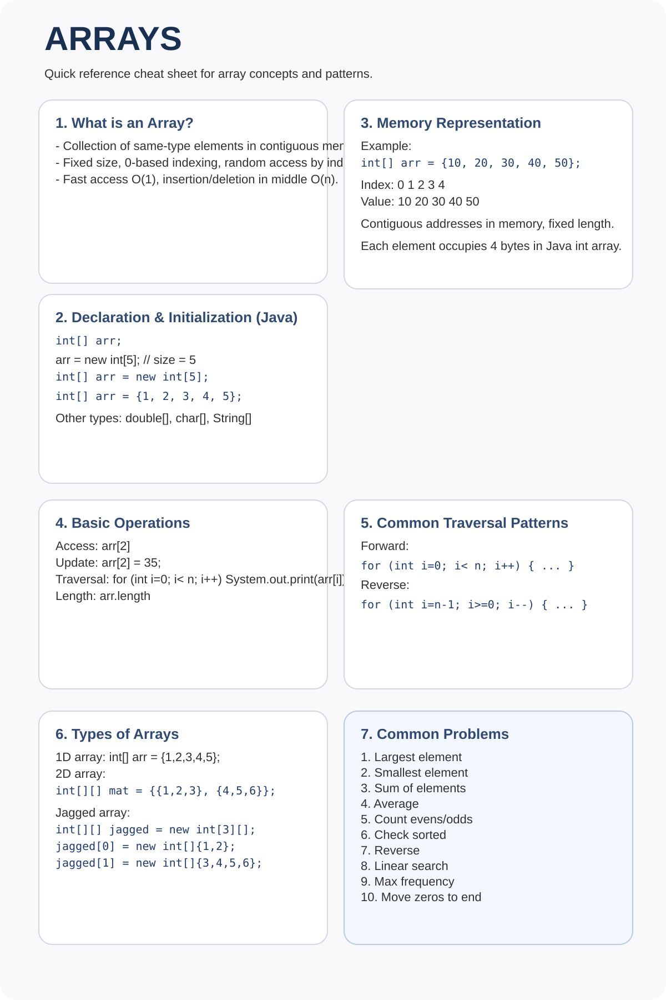

# Arrays

> Concepts, patterns, and revision notes — not code.

---

## Core Concepts

- Arrays are stored in **contiguous memory** — random access is O(1).
- Insertion/deletion at middle is O(n) due to shifting.
- Two-pointer and sliding window are the most common array patterns.

---

## Two Pointer Pattern

**When to use:** Sorted array, finding pair/triplet with a target sum, removing duplicates.

**Template:**
- Left pointer starts at beginning, right at end.
- Move pointers based on condition: if `sum < target`, move left right; if `sum > target`, move right left.

**Key problems:**
- Two Sum II (sorted)
- 3Sum
- Container With Most Water
- Trapping Rain Water

---

## Sliding Window Pattern

**When to use:** Subarray/substring problems with a size constraint or condition.

**Fixed window:** Window size is given — slide by adding right element, removing left.

**Variable window:** Expand right until condition breaks, shrink from left.

**Key problems:**
- Maximum sum subarray of size k
- Longest substring without repeating characters
- Minimum window substring

---

## Prefix Sum

- Build a prefix array where `prefix[i] = sum of arr[0..i]`.
- Range sum query `[l, r]` = `prefix[r] - prefix[l-1]` in O(1).
- Useful for subarray sum problems.

**Key insight:** Subarray sum equals target → find `prefix[j] - prefix[i] = target` → use a hashmap to count `prefix[j] - target`.

---

## Kadane's Algorithm (Max Subarray Sum)

- Track `currentSum` and `maxSum`.
- At each element: `currentSum = max(element, currentSum + element)`
- If `currentSum` is negative, reset to 0 (or current element).
- Time: O(n), Space: O(1)

---

## Sorting Patterns

| Algorithm | Time | Space | Stable? | When to use |
|---|---|---|---|---|
| Bubble Sort | O(n²) | O(1) | Yes | Never in practice |
| Selection Sort | O(n²) | O(1) | No | Small arrays |
| Insertion Sort | O(n²) | O(1) | Yes | Nearly sorted data |
| Merge Sort | O(n log n) | O(n) | Yes | When stability matters |
| Quick Sort | O(n log n) avg | O(log n) | No | General purpose |

---

## Dutch National Flag (3-way Partition)

- Partition array into three parts (e.g., 0s, 1s, 2s) in one pass.
- Three pointers: `low`, `mid`, `high`.
- Swap based on value at `mid`.

---

## Common Edge Cases

- Empty array or single element.
- All elements the same.
- Already sorted / reverse sorted.
- Negative numbers in sum problems.
- Integer overflow when summing large values.

---

## Important Observations

- If you need `O(1)` space in a subarray problem — think prefix XOR or prefix sum with hashmap.
- Sorting often unlocks two-pointer on an otherwise O(n²) problem.
- When asked about duplicates, think of using a `Set` or sorting first.
- `nums[i] ^ nums[i]` = 0 — XOR cancels duplicates (find unique element).

---

*Add notes for each problem pattern as you encounter them.*
