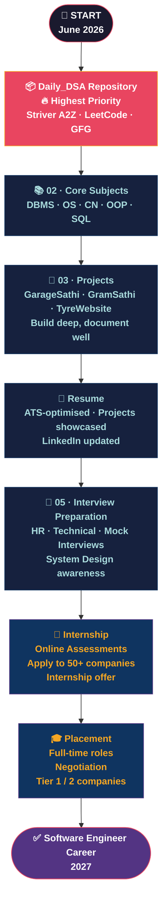

# 🗺️ MASTER ROADMAP — Placement Prep 2026

> **Goal:** Land a Software Engineering internship or placement by 2026–27.
> **Strategy:** Phase-by-phase, daily consistency, tracked progress.

← [Back to Repository Root](../README.md)

---

## 🚀 The Journey

---

## 📅 Phase Timeline

| Phase | Period | Focus | Target |
|---|---|---|---|
| 🟥 Phase 1 | Jun – Aug 2026 | DSA Foundations + Core CS Basics | 100 problems, OOP + DBMS done |
| 🟦 Phase 2 | Sep – Nov 2026 | Advanced DSA + Projects + AI Engineering | 200 problems, 3 projects documented |
| 🟪 Phase 3 | Dec 2026 – Feb 2027 | DP + OS + CN + System Design | 280 problems, interview-ready |
| 🟩 Phase 4 | Mar – May 2027 | Mock Interviews + Applications | Internship / placement offer |

---

## 🏆 Target Companies

### Tier 1 — Dream
Google · Microsoft · Amazon · Meta · OpenAI · Anthropic

### Tier 2 — Target
Razorpay · CRED · Zepto · Meesho · Groww · PhonePe · Adobe · Atlassian

### Tier 3 — Backup
TCS Digital · Infosys SP · Wipro Elite · Capgemini GenC Next

---

## 🔗 Key Resources

| Resource | Use | Priority |
|---|---|---|
| [Striver A2Z](https://takeuforward.org) | DSA | ⭐⭐⭐⭐⭐ |
| [LeetCode](https://leetcode.com) | Problem solving | ⭐⭐⭐⭐⭐ |
| [NeetCode 150](https://neetcode.io) | Pattern-based DSA | ⭐⭐⭐⭐⭐ |
| [System Design Primer](https://github.com/donnemartin/system-design-primer) | System Design | ⭐⭐⭐⭐ |
| [LangChain Docs](https://python.langchain.com) | AI Engineering | ⭐⭐⭐⭐ |
| [Interviewing.io](https://interviewing.io) | Mock Interviews | ⭐⭐⭐⭐ |

---

*This is a living document. Update as phases evolve.*
