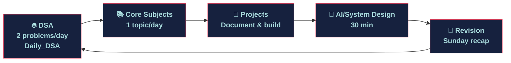

# 📅 WEEKLY PLAN

> Plan each week on Monday. Review on Sunday. One week = one unit of progress.

← [Back to Roadmap](./README.md) | ← [Back to Root](../README.md)

---

## ☀️ TODAY — Daily Action Dashboard

> Copy this checklist into your notes app or run through it every day.

```
□  Solve 2 DSA problems (Daily_DSA repo)
□  Revise 1 Core Subject topic (make notes)
□  Commit code / update this repository
□  Update progress tracker
□  10-minute review: what did I learn today?
```

---

## 📆 Week Template

> Duplicate this block each Monday and fill in your planned topics.

### Week — [Date Range]

| Day | DSA (Daily_DSA) | Core Subject | Project / AI / Extra |
|---|---|---|---|
| Mon | | | |
| Tue | | | |
| Wed | | | |
| Thu | | | |
| Fri | | | |
| Sat | | Mock / Revision | |
| Sun | Review + Update tracker | | Rest / Read |

**Weekly goal:**
> _Write 1 sentence: what do you want to have achieved by Sunday?_

**Sunday reflection:**
> _What went well? What didn't? What needs adjustment?_

---

## 🔄 Current Weekly Loop



---

## 🕐 Suggested Daily Time Split

| Block | Time | Activity |
|---|---|---|
| 🌅 Morning | 90 min | DSA — 2 problems + review yesterday's solution |
| ☀️ Afternoon | 60 min | Core Subject — 1 topic, make notes |
| 🌇 Evening | 60 min | Project work / AI Engineering reading |
| 🌙 Night | 30 min | Revise + commit + update tracker |

---

## 📋 Active Weeks Log

### Week 1 — Jun 2–8, 2026

| Day | DSA | Core | Extra |
|---|---|---|---|
| Mon | Arrays – Basics | OOP – Pillars | Repo setup |
| Tue | Arrays – Prefix Sum | OOP – Classes | — |
| Wed | Arrays – Two Pointers | OOP – Inheritance | — |
| Thu | Arrays – Sliding Window | OOP – Polymorphism | — |
| Fri | Arrays – Kadane's | OOP – Abstraction | — |
| Sat | Arrays – Dutch Flag | Revision: OOP | — |
| Sun | Revise Arrays | — | Update tracker |

**Reflection:** _(fill in after the week)_

---

### Week 2 — Jun 9–15, 2026

| Day | DSA | Core | Extra |
|---|---|---|---|
| Mon | Strings – Basics | DBMS – ER Model | — |
| Tue | Strings – Anagram | DBMS – Normalization | — |
| Wed | Strings – Sliding Window | DBMS – SQL Joins | — |
| Thu | Strings – Palindrome | DBMS – ACID | — |
| Fri | Strings – KMP | DBMS – Indexing | — |
| Sat | Mixed: Array + String | Revision: DBMS | — |
| Sun | Review | — | Update tracker |

**Reflection:** _(fill in after the week)_

---

> Add new weeks below as they begin.

---

*Last updated: June 2026*
