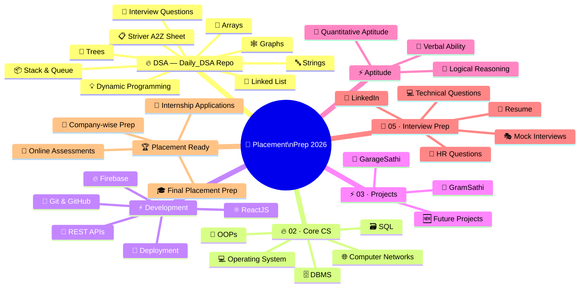
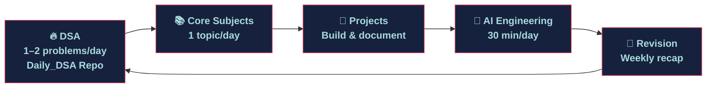

<h1 align="center">🎯 Placement Prep 2026</h1>

<p align="center">
  <em>A personal, structured knowledge base built throughout 2026 — from first principles to placement-ready.</em>
</p>

<p align="center">
  
  
  
  
</p>

---

## 🗂️ Repository Architecture

This repository is a structured **Placement Preparation Hub** covering all areas required for Software Engineering internships and placements — except DSA, which is maintained in a dedicated repository for daily practice.

| # | Module | Contents |
|---|---|---|
| 01 | 🗺️ [Roadmap](./01-Roadmap/) | Learning plan, progress tracker, active queue |
| 02 | 📚 [Core CS Subjects](./02-Core-Subjects/) | DBMS, OOP, OS, Computer Networks |
| 03 | 🔧 [Projects](./03-Projects/) | GarageSathi, GramSathi, TyreWebsite deep dives |
| 04 | 🤖 [AI Engineering](./04-AI-Engineering/) | LLMs, RAG, Embeddings, Agents, Vector DBs |
| 05 | 🎤 [Interview Prep](./05-Interview-Prep/) | HR questions, technical Q&A, resume notes |
| 06 | 🏗️ [System Design](./06-System-Design/) | Concepts, case studies, design patterns |

> **DSA practice is maintained separately in:**
> 🔗 **[Daily_DSA Repository](https://github.com/Harshaghera111/Daily_DSA)** — Striver A2Z Sheet · LeetCode · Problem patterns

---

## 🧭 Repository Navigation

```
Roadmap → Core Subjects → Projects → AI Engineering → Interview Prep → System Design
   01          02             03            04               05               06
```

| ← Prev | Module | Next → |
|---|---|---|
| — | 🗺️ [01 · Roadmap](./01-Roadmap/) | 📚 [02 · Core Subjects](./02-Core-Subjects/) |
| 🗺️ [01 · Roadmap](./01-Roadmap/) | 📚 [02 · Core Subjects](./02-Core-Subjects/) | 🔧 [03 · Projects](./03-Projects/) |
| 📚 [02 · Core Subjects](./02-Core-Subjects/) | 🔧 [03 · Projects](./03-Projects/) | 🤖 [04 · AI Engineering](./04-AI-Engineering/) |
| 🔧 [03 · Projects](./03-Projects/) | 🤖 [04 · AI Engineering](./04-AI-Engineering/) | 🎤 [05 · Interview Prep](./05-Interview-Prep/) |
| 🤖 [04 · AI Engineering](./04-AI-Engineering/) | 🎤 [05 · Interview Prep](./05-Interview-Prep/) | 🏗️ [06 · System Design](./06-System-Design/) |
| 🎤 [05 · Interview Prep](./05-Interview-Prep/) | 🏗️ [06 · System Design](./06-System-Design/) | — |

---

## 📍 In-Page Navigation

| Section | Link |
|---|---|
| 🗺️ Main Roadmap | [Flowchart](#️-main-roadmap-flowchart) |
| 🧠 Mind Map | [Mind Map View](#-mind-map-roadmap) |
| 📅 Weekly Workflow | [Daily Routine](#-weekly-workflow) |
| 📊 Progress Tracker | [Progress](#-progress-tracker) |
| 🗂️ Repository Structure | [Structure](#️-repository-structure) |

---

## 🗺️ Main Roadmap Flowchart

> **Version 1 — Linear Flowchart** · Priority-tagged · GitHub Mermaid Compatible

```mermaid
flowchart TD
    START(["🚀 START — Placement Prep 2026"]):::start

    START --> DSA
    START --> CORE
    START --> DEV
    START --> PROJ
    START --> APT
    START --> INTERVIEW
    INTERVIEW --> READY

    %% ─── DSA ──────────────────────────────────────
    DSA["🔥 DSA\n**Highest Priority**\n📦 Daily_DSA Repository"]:::high

    DSA --> DSA1["📋 Striver A2Z Sheet"]:::node
    DSA --> DSA2["📐 Arrays"]:::node
    DSA --> DSA3["🔤 Strings"]:::node
    DSA --> DSA4["🔗 Linked List"]:::node
    DSA --> DSA5["📦 Stack & Queue"]:::node
    DSA --> DSA6["🌳 Trees"]:::node
    DSA --> DSA7["🕸️ Graphs"]:::node
    DSA --> DSA8["💡 Dynamic Programming"]:::node
    DSA --> DSA9["🎤 Interview Questions"]:::node

    %% ─── CORE CS ───────────────────────────────────
    CORE["🔥 02 · Core CS Subjects\n**High Priority**"]:::high

    CORE --> C1["🗄️ DBMS"]:::node
    CORE --> C2["💻 Operating System"]:::node
    CORE --> C3["🌐 Computer Networks"]:::node
    CORE --> C4["🧩 OOPs"]:::node
    CORE --> C5["🗃️ SQL"]:::node

    %% ─── DEVELOPMENT ────────────────────────────────
    DEV["⚡ Development\n**Medium Priority**"]:::medium

    DEV --> D1["⚛️ ReactJS"]:::node
    DEV --> D2["🔥 Firebase"]:::node
    DEV --> D3["🔌 REST APIs"]:::node
    DEV --> D4["🐙 Git & GitHub"]:::node
    DEV --> D5["🚀 Deployment"]:::node

    %% ─── PROJECTS ────────────────────────────────────
    PROJ["⚡ 03 · Projects\n**Medium Priority**"]:::medium

    PROJ --> P1["🔧 GarageSathi"]:::node
    PROJ --> P2["🌾 GramSathi"]:::node
    PROJ --> P3["🆕 Future Projects"]:::node

    %% ─── APTITUDE ────────────────────────────────────
    APT["⚡ Aptitude & Reasoning\n**Medium Priority**"]:::medium

    APT --> A1["🔢 Quantitative Aptitude"]:::node
    APT --> A2["🧠 Logical Reasoning"]:::node
    APT --> A3["📝 Verbal Ability"]:::node

    %% ─── INTERVIEW PREP ──────────────────────────────
    INTERVIEW["🎯 05 · Interview Preparation\n**Placement Phase**"]:::placement

    INTERVIEW --> I1["🤝 HR Questions"]:::node
    INTERVIEW --> I2["💻 Technical Questions"]:::node
    INTERVIEW --> I3["📄 Resume"]:::node
    INTERVIEW --> I4["💼 LinkedIn"]:::node
    INTERVIEW --> I5["🎭 Mock Interviews"]:::node

    %% ─── PLACEMENT READY ─────────────────────────────
    READY["🏆 PLACEMENT READY"]:::ready

    READY --> R1["📨 Internship Applications"]:::node
    READY --> R2["🏢 Company-wise Prep"]:::node
    READY --> R3["📝 Online Assessments"]:::node
    READY --> R4["🎓 Final Placement Prep"]:::node

    %% ─── STYLES ─────────────────────────────────────
    classDef start fill:#1a1a2e,stroke:#e94560,color:#fff,font-weight:bold,rx:12
    classDef high fill:#16213e,stroke:#e94560,color:#f5a623,font-weight:bold
    classDef medium fill:#0f3460,stroke:#533483,color:#a8dadc,font-weight:bold
    classDef placement fill:#533483,stroke:#e94560,color:#fff,font-weight:bold
    classDef ready fill:#e94560,stroke:#f5a623,color:#fff,font-weight:bold,rx:12
    classDef node fill:#1a1a2e,stroke:#0f3460,color:#a8dadc
```



---

## 🧠 Mind Map Roadmap

> **Version 2 — Mind Map Style** · Topic-clustered · Hierarchical view



---

## 🏷️ Priority Legend

| Label | Meaning | Topics |
|---|---|---|
| 🔥 **High Priority** | Foundation — do this first, daily | DSA (Daily_DSA), Core CS Subjects |
| ⚡ **Medium Priority** | Build alongside DSA | Development, Projects, Aptitude |
| 🎯 **Placement Phase** | Activate once foundation is solid | Interview Prep, Applications |

---

## 📅 Weekly Workflow

> Treat this as a **daily loop**, not a sequential one-time process.



### Suggested Daily Time Split

| Time Block | Activity | Duration |
|---|---|---|
| 🌅 Morning | DSA Problem Solving (Daily_DSA) | 90 min |
| ☀️ Mid-day | Core CS Subject Study | 60 min |
| 🌇 Evening | Development / Project Work | 60 min |
| 🌙 Night | Revision + Notes Update | 30 min |

---

## 📊 Progress Tracker

> Update this section regularly as you complete each area.

### 🔥 DSA Progress *(tracked in [Daily_DSA](https://github.com/Harshaghera111/Daily_DSA))*

| Topic | Status | Notes |
|---|---|---|
| Striver A2Z Sheet | 🟡 In Progress | |
| Arrays | 🟡 In Progress | |
| Strings | 🟡 In Progress | |
| Linked List | 🔴 Not Started | |
| Stack & Queue | 🔴 Not Started | |
| Trees | 🔴 Not Started | |
| Graphs | 🔴 Not Started | |
| Dynamic Programming | 🔴 Not Started | |
| Interview Questions | 🔴 Not Started | |

### 📚 Core Subjects Progress — [02-Core-Subjects](./02-Core-Subjects/)

| Subject | Status | Notes |
|---|---|---|
| DBMS | 🟡 In Progress | |
| Operating System | 🔴 Not Started | |
| Computer Networks | 🔴 Not Started | |
| OOPs | 🟡 In Progress | |
| SQL | 🔴 Not Started | |

### 🔧 Project Progress — [03-Projects](./03-Projects/)

| Project | Status | Notes |
|---|---|---|
| GarageSathi | 🟡 Deep Dive | |
| GramSathi | 🟢 Built | |
| Future Projects | 🔴 Planning | |

### 🎯 Interview Readiness — [05-Interview-Prep](./05-Interview-Prep/)

| Area | Status | Notes |
|---|---|---|
| Resume | 🔴 Draft | |
| LinkedIn | 🔴 Needs Update | |
| HR Questions | 🔴 Not Started | |
| Technical Questions | 🔴 Not Started | |
| Mock Interviews | 🔴 Not Started | |
| Online Assessments | 🔴 Not Started | |

> **Status Key:** 🟢 Done · 🟡 In Progress · 🔴 Not Started

---

## 🗂️ Repository Structure

```
Placement-Prep-2026/
│
├── 01-Roadmap/            ← 🗺️  Learning plan, active queue, progress tracker
├── 02-Core-Subjects/      ← 📚  DBMS, OOP, OS, Computer Networks, SQL
├── 03-Projects/           ← 🔧  GarageSathi, GramSathi, TyreWebsite
├── 04-AI-Engineering/     ← 🤖  LLMs, RAG, Embeddings, Agents, Vector DBs
├── 05-Interview-Prep/     ← 🎤  HR answers, technical Q&A, resume notes
└── 06-System-Design/      ← 🏗️  Concepts and case studies
```

> 📦 **DSA** → maintained in [Daily_DSA](https://github.com/Harshaghera111/Daily_DSA) (separate repository)

---

## 💡 Philosophy

> **Understand first. Memorise later. Build on top.**

- Notes go in *as I learn*, not after
- Each file is a living document, not a finished resource
- I revisit and update rather than writing once and moving on
- Quality over quantity — understand 10 problems deeply over skimming 100

---

<p align="center">
  <em>Started June 2026 · Updated continuously · Built in public</em>
</p>
